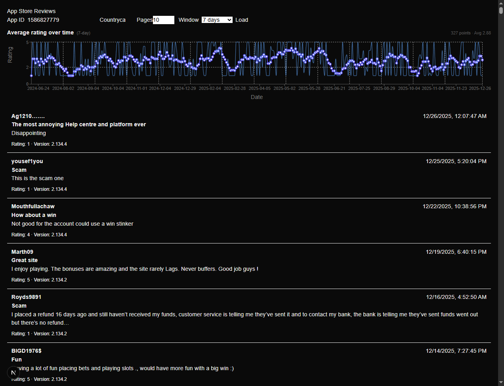

# iTunes App Review Aggregator

A small Next.js app that fetches iTunes / App Store customer reviews for an app, shows the list of reviews and an interactive chart that visualizes rating trends (a moving average) over time.

This repo is a compact developer-focused tool for exploring App Store reviews programmatically and visually. It includes a server-side helper that follows the iTunes RSS feed pagination and a client UI with configuration for country, pages to fetch, and a moving-average window.

[](./docs/website.png)

> [!NOTE]  
> This project is not actively maintained but open to fixes and improvements.

## Features

- Fetch customer reviews from the iTunes RSS JSON endpoint (server-side helper).
- UI to configure:
  - App ID
  - Country code (e.g., `us`, `ca`)
  - Number of pages to fetch (1–10, default 3)
  - Moving-average window (7 / 14 / 21 / 1 month / 6 months)
- Interactive chart (Recharts) that plots the moving average and daily averages.
- Hover tooltip with formatted date and values (tooltip date is rendered darker for readability).
- Graceful fallback when Recharts is not installed (the app still works and tests run).
- Unit tests and UI tests (Vitest + Testing Library).

## What the moving average is

- The chart plots a moving average (window configurable) computed as:
  - Group reviews by UTC day (ISO `YYYY-MM-DD`).
  - Daily average = (sum of ratings that day) / (count of reviews that day).
  - Moving average for a given day = (sum of ratings across the window of days ending on that day) / (total number of reviews across those days).
- This is a weighted moving average using actual review counts.

## Limits & defaults

- `pages` default: 3 (if the `pages` query parameter is not provided).
- Max allowed pages: 10 (client and API enforce this).

## Quick start

Requirements: Node.js (recommended LTS), npm.

1. Install dependencies:

```bash
npm install
```

2. Run the dev server:

```bash
npm run dev
```

3. Open http://localhost:3000 and use the UI. Enter an App ID and click `Load`.

Notes:
- The app will auto-load on mount with defaults (App ID empty, country `ca`, pages default). Set an App ID before clicking Load to fetch real reviews.
- The Pages input is limited to 1–10.

Optional: Install Recharts for the interactive chart (if you want the full interactive chart in your environment):

```bash
npm install recharts
# if you hit peer dependency conflicts, try:
# npm install recharts --legacy-peer-deps
```

If `recharts` is not installed, the app will show a simple fallback summary and the tests still run (the chart component does a dynamic import of Recharts).

## API (internal)

This app exposes a small API route used by the UI:

- GET `/api/reviews?appId=<id>&country=<cc>&pages=<n>`
  - `appId` (required): App Store numeric id
  - `country` (optional): two-letter country code; defaults to `us` on the server if not provided
  - `pages` (optional): number of RSS pages to fetch; defaults to 3 when missing and is clamped to 10

Response shape:

```json
{
  "reviews": [{ "id": "...", "author": "...", "content": "...", "rating": 5, "date": "2020-01-01T00:00:00Z", ... }],
  "meta": {
    "pagesFetched": 1,
    "requestedPages": 1,
    "totalReviews": 10,
    "source": "itunes-rss",
    "partial": false,
    "appName": "App Title (if available)"
  }
}
```

The server-side helper `fetchReviews` returns `{ reviews, meta }` and now attempts to extract the app title (appName) from the RSS feed if available.

## Testing

Run unit + UI tests with:

```bash
npm test
```

Notes about tests:
- The test setup includes a minimal `ResizeObserver` polyfill so Recharts' `ResponsiveContainer` can render in jsdom.
- The chart component dynamically imports Recharts; tests assert presence of either the real chart container (`data-testid="rating-chart"`) or a fallback (`data-testid="rating-chart-fallback").

## Developer notes

- Key source files:
  - `lib/reviews.ts` — server-side parser and feed follower, plus helpers to compute daily/cumulative/moving averages.
  - `app/api/reviews/route.ts` — Next.js API route that proxies the feed helper to the client.
  - `components/ReviewsPage.tsx` — client page with inputs and wiring.
  - `components/RatingChart.tsx` — chart UI (uses dynamic import of Recharts for optional interactivity).
  - `components/ReviewsList.tsx` — renders review list; hides "No reviews found." while loading.

- Accessibility:
  - The moving-average select has `aria-label="moving-average-window"`.
  - The Pages input has `aria-label="Pages"`.

- Styling is minimal and inline for this sample app; if you integrate this into a larger project, consider extracting styles or using Tailwind/CSS modules.

## Troubleshooting

- If the chart does not appear interactive, install `recharts` (see Optional section). If installation causes peer dependency errors, use `--legacy-peer-deps` but prefer resolving peer versions.
- If the feed returns unexpected structure, the parser attempts to be permissive; open the network devtools to inspect the raw feed and debug parsing in `lib/reviews.ts`.

## License & credits

Small demo / utility code — feel free to reuse and adapt.

